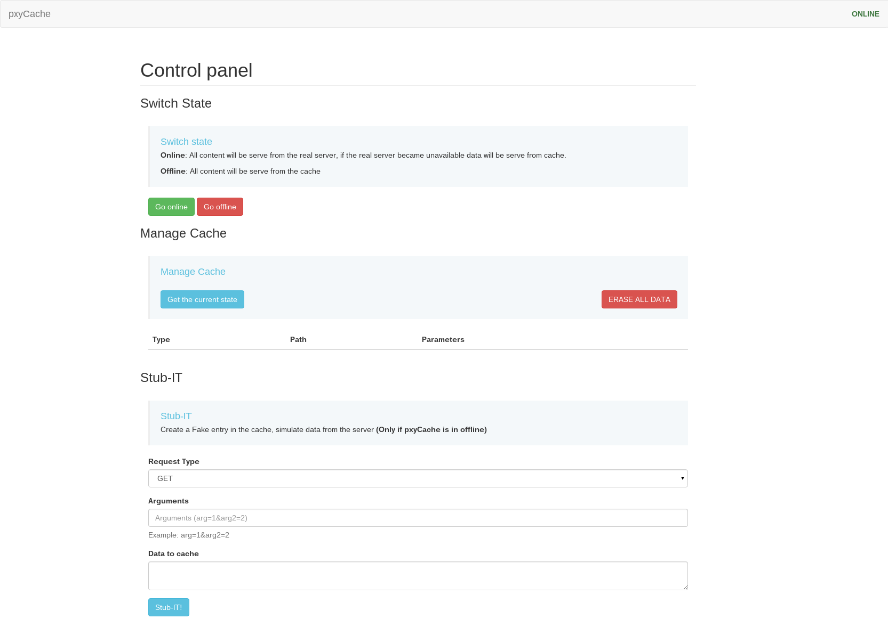

pxyCache
========

PxyCache is a simple Proxy, With offline capacities. pxyCache also provide an Admin Panel to help developpers to see and manage the cache of his "Proxy".

## Usage

### Start the "Proxy" in online state
its mean its serve the content of the __real domain__

```bash
python2 serve.py --realdomain yourdomain.tld --realport 80 --cachepath "/tmp/cache" --online
```

### Start the "Proxy" in offline state
its mean its serve the content from your __local cache__ _if exist_

```bash
python2 serve.py --realdomain yourdomain.tld --realport 80 --cachepath "/tmp/cache" --offline
```

### State of the proxy

If the real domain became unavailable during the execution, the proxy will automatically switch in offline state for the request and serve the cached data if available.


## Manage pxyCache

Management can be done via curl call, or most simply with the Interface



